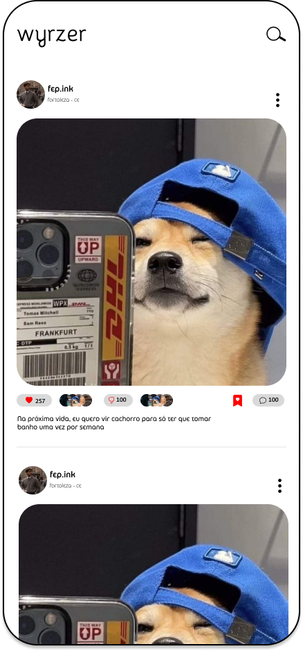
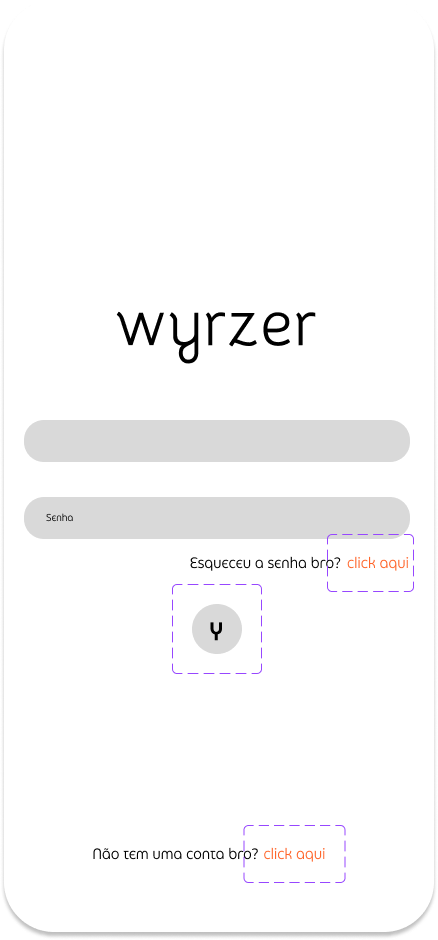
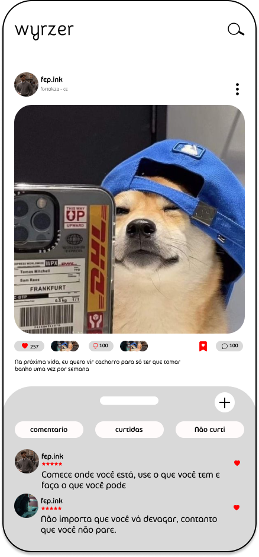
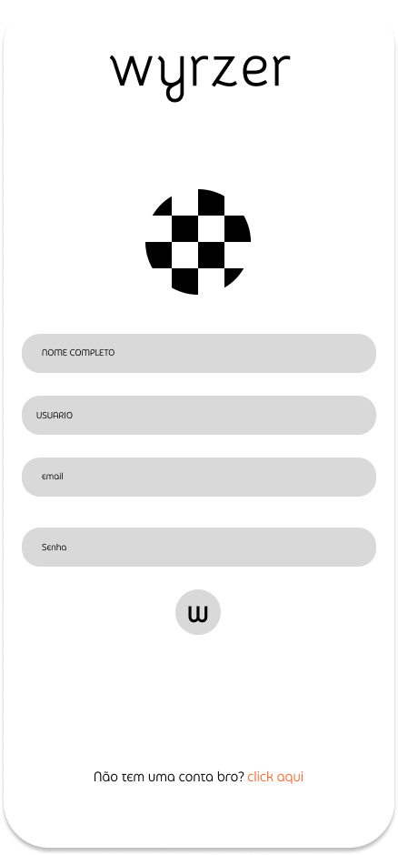

# Wyrzer - Sua Rede Social em Flutter

Bem-vindo ao Wyrzer, a sua nova rede social desenvolvida em Flutter e Dart!

## Capturas de Tela

| Tela Inicial           | Tela de Login           |
| ---------------------- | ----------------------- |
|  |  |

| Tela de Comentário      | Tela de Cadastro        |
| ----------------------- | ----------------------- |
|  |  |

## Como Contribuir

Se você deseja contribuir para o desenvolvimento do Wyrzer, siga estas etapas:

1. Faça um fork do repositório.
2. Clone o fork para a sua máquina local.
3. Crie uma branch para suas alterações: `git checkout -b feature/nova-funcionalidade`.
4. Faça suas alterações e commit: `git commit -m "Adiciona nova funcionalidade"`.
5. Faça um push para a sua branch: `git push origin feature/nova-funcionalidade`.
6. Abra um Pull Request para a branch principal do repositório original.

Esperamos ansiosos por suas contribuições!

## Requisitos do Sistema

Certifique-se de ter Flutter e Dart instalados em sua máquina. Você pode encontrar mais informações em [flutter.dev](https://flutter.dev).

## Licença

Este projeto está licenciado sob a Licença MIT - consulte o arquivo [LICENSE](LICENSE) para obter detalhes.

---
